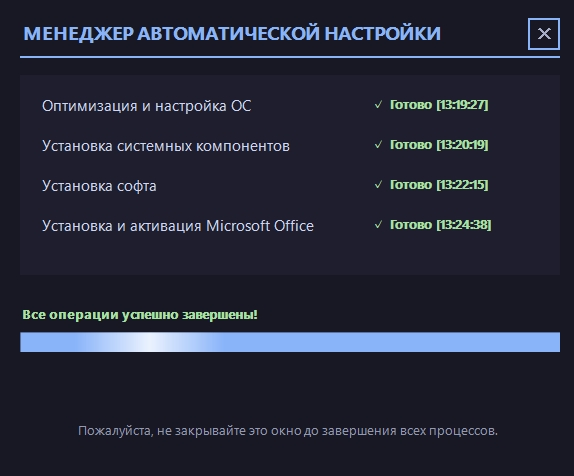

# 🚀 WAD — Windows Auto-Deployment


  

**Автоматическое развёртывание и пост-установка Windows: от разметки диска до готовой системы с софтом.**
Один запуск — и на выходе чистая настроенная система: без встроенного мусора и рекламы, с библиотеками,
базовым набором программ и офисным пакетом. Единственное, что делает человек, — выбирает раздел при установке.

**Стек:** Windows PowerShell 5.1 · WinForms + GDI (свой интерфейс: тёмное окно, спокойные сине-серые тона, контраст текста не ниже 7:1) · файл ответов `autounattend.xml` · GitHub Actions (проверки)

## 🎬 Как это выглядит

| Менеджер: задачи, статусы, прогресс |
|---|
|  |

Скриншот снят в режиме **Custom** — поэтому задач четыре, а не пять (см. ниже).

## ⚡ Два способа запуска

| | **Способ 1** — установка с нуля | **Способ 2** — Windows уже стоит |
|---|---|---|
| Что нужно | флешка с оригинальным образом Windows + `autounattend.xml` в корне | один файл `loader.ps1` |
| Режим | **Custom** | **Clean** |
| Что делает до менеджера | файл ответов ставит ОС, создаёт учётную запись, удаляет пакеты, настраивает систему | — |
| Задач в менеджере | 4 | 5 (добавляется «Первоначальная настройка ОС») |
| Результат | одинаковый | одинаковый |

Разделение на два режима — не дублирование, а расчёт: в режиме **Custom** часть работы уже выполнил файл
ответов, поэтому пятая задача и часть списка удаляемых приложений там просто не нужны. Оба пути приводят
систему к одинаковому состоянию.

## ✨ Что умеет

- **🧹 Оптимизация ОС** — удаление встроенных приложений и рекламы, полное удаление OneDrive, возврат классического просмотра фотографий (через ассоциации по умолчанию), настройка файла подкачки под объём ОЗУ.
- **🧩 Системные компоненты** — Visual C++ 2015–2022 (x86 и x64), DirectX End-User Runtimes, .NET Framework 3.5, .NET 8 Desktop Runtime.
- **📦 Базовый софт** — Chrome, Steam (автозапуск сразу выключается), WinRAR, qBittorrent, ShareX, K-Lite Codec Pack. Тихая установка, повторные попытки загрузки, отбраковка повреждённых файлов.
- **📝 Офисный пакет** — установка Office LTSC с рабочим набором: Word, Excel, PowerPoint.
- **🖥️ Менеджер** — окно с задачами, статусами и анимированным прогрессом; модули идут по очереди, сбой одного не прерывает остальные.
- **🧹 Финальная зачистка** — после успешного прохождения удаляются временные файлы и папка со скриптами, система остаётся в чистом виде.

## 🚀 Быстрый старт

### Способ 1 — установка Windows с нуля

1. Запишите оригинальный образ Windows 10/11 на флешку (Rufus или аналог).
2. Скопируйте `autounattend.xml` в **корень флешки**.
3. Загрузитесь с флешки и выберите раздел для установки **вручную** — разметка диска намеренно не автоматизирована, чтобы исключить случайное форматирование дисков с данными.
4. Дальше установка и настройка идут сами: файл ответов подтянет актуальные скрипты и запустит менеджер.

### Способ 2 — уже установленная Windows

```powershell
# PowerShell от имени администратора
Set-ExecutionPolicy -Scope Process -ExecutionPolicy Bypass -Force
.\loader.ps1
```

Лоадер сам запросит права администратора, проверит соединение, скачает актуальные скрипты в
`C:\Windows\Setup\Scripts` и запустит менеджер.

## ⚠️ Ограничения

- Windows 10/11 **x64**; на других редакциях и версиях не проверялось.
- Нужен интернет: компоненты и программы скачиваются с сайтов производителей.
- Нужны права администратора — часть операций без них молча не выполнится.
- В режиме Custom учётная запись `Admin` создаётся **без пароля** и с автоматическим входом: это необходимо для установки без участия человека. Задайте пароль после первого входа.
- Версии программ и ссылки на них зафиксированы в скриптах. Ссылки обновляемых файлов (например, Chrome) вендор перезаливает, поэтому проверка по хэшу для них не включена.
- Финальная зачистка удаляет папку `C:\Windows\Setup\Scripts` целиком. На чистой Windows её создают сами скрипты, но в OEM-образах в ней могут лежать чужие файлы.

## 🧪 Качество

Полноценных тестов на живой системе нет — итоговая проверка делается прогоном в чистой виртуальной
машине. Что проверяется автоматически при каждом изменении (GitHub Actions, `tools/check.ps1`):
разбор синтаксиса всех скриптов под **Windows PowerShell 5.1** (не только под PowerShell 7),
совпадение общих файлов двух режимов, кодировка UTF-8 с BOM и статический анализ PSScriptAnalyzer
на ошибки.

Статусы задач в менеджере честные: если этап завершился с замечаниями, он печатает их список в лог
и отдаёт код ошибки, поэтому задача показывается красной, а не «✓ Готово».

## 📜 История

- **0.1 — 7–15 июля 2026:** первая рабочая версия: файл ответов, загрузчик, менеджер с интерфейсом, шесть модулей.
- **0.2 — 22 июля 2026:** разделение на два режима — Clean (пять задач) и Custom (четыре задачи).
- **0.3 — 25 июля 2026:** просмотр фотографий настраивается через DISM-ассоциации, файл подкачки получил вторую ветку (32 ГБ и больше — отключение).
- **0.4 — 11 сентября 2026:** честные статусы задач (сбой больше не выглядит как успех), перенос
  улучшений из Custom в Clean, проверки при каждом изменении.
- **Дальше:** переработка v2 — один набор модулей вместо двух папок с копиями, отчёт по шагам
  и продолжение установки после сбоя или выключения.

Подробная история изменений — в **[CHANGELOG.md](CHANGELOG.md)**.
